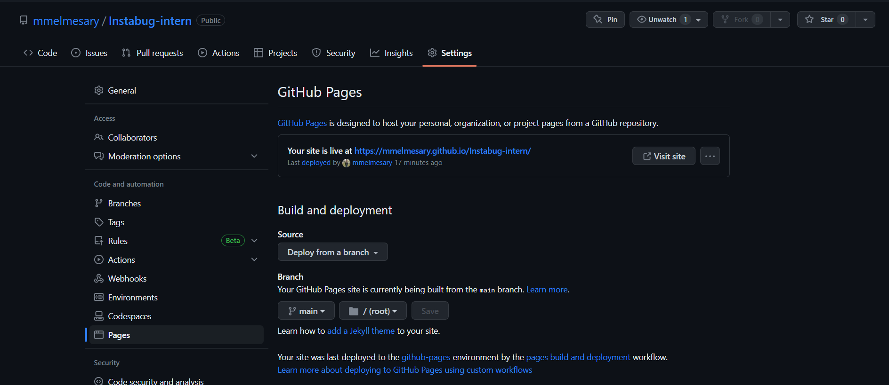
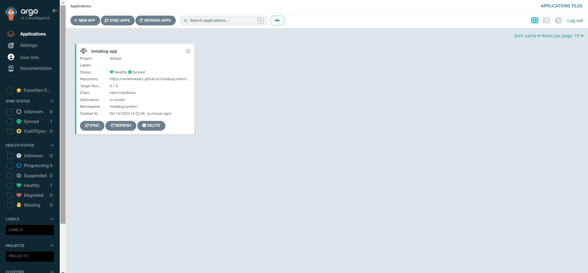
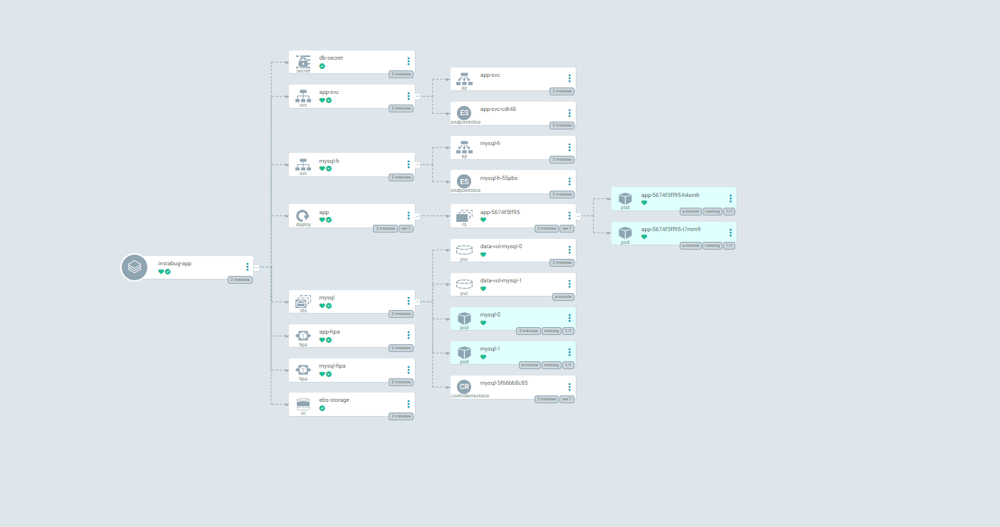
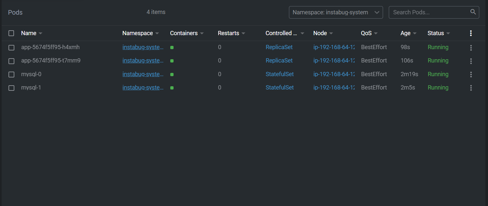
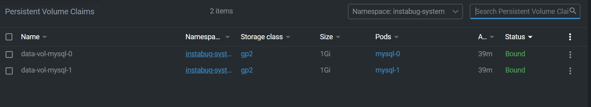
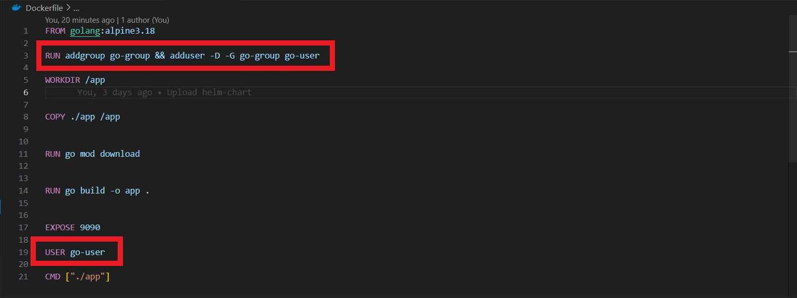
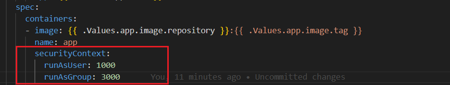

# Instabug intern task 

🚨 This DevOps project showcases how to use Dockerfile, Jenkinsfile, docker-compose, k8s, Helm charts, and ArgoCD 

## Step 1 : Dockerized Golang Application 

The `Dockerfile` containes the instrutions how to build and run a Go application using Docker, and it exposes the application on port `9090`.

To build the Docker image for this application, run the following command:

```bash
docker build -t melmesary/golang-app:v1.0 .
```
> You should see an output like that when run the above command

>  

______ 

 ## Step 2 : Pipeline Job

**To use the pipeline job, you need to have Jenkins installed and install docker-client plugin to run to run Docker commands inside Jenkins. Also You'll need to set up your DockerHub credentials in Jenkins**

**First** The `jenkins_with_docker` file containes all the instructions to use docker-client with jenkins, so try to build an image from that file and then run a container

To build the Jenkins image, run the following command:

```bash
docker build -t melmesary/jenkins:v1.0 -f jenkins_with_docker .
```

To run the Jenkins container, run the following command:

```bash
docker run --name jenkins -p 8080:8080 -v /var/run/docker.sock:/var/run/docker.sock melmesary/jenkins:v1.0
```
Run the following command to check that the container is up and running 

```bash
docker ps 
```
Open the Jenkins UI

 

> **✨ Contents**, Your Jenkins is now ready to create a job and run the pipline :tada:

 **Second** the `Jenkinsfile` file defines a pipeline job for building the application using the Dockerfile and reporting any errors that occur during the build process.

The pipeline job performs the following steps:

1. Clone the repository and checkout the latest code from the main branch.

1. Build the Docker image using the Dockerfile in the root directory.

1. Check for errors during the build process and report them.

1. Tag the Docker image and push it to DockerHub.

>  


**Now** Create a new job and run your pipeline 

>  

after running your pipeline you should see that your pipeline finished successfuly

> 
 
> 

___
# Step 3: Docker Compose

**The `docker-compose.yml` file defines a multi-container application that includes a MYSQL database service and our go application service.**

 To run the application using Docker Compose, run the following command:

 ```bash
 docker-compose up 
 ```

 To stop the application, run the following command:

```bash
 docker-compose down 
```
To perform a *health check*, run the following command:

```bash
curl localhost:9090/healthcheck
```
it returns an `OK` message

> 

___

# Step 4 : Deploying the Application on Kubernetes with Helm

To deploy the application on Kubernetes, we'll use **Helm**, a package manager for Kubernetes that simplifies the process of managing and deploying applications. We'll use Helm to install the application, along with the necessary configurations for high availability and volume persistence, and to expose a LoadBalancer service that can be accessed from outside the cluster.

#### Prerequisites

[x] deploy an EKS cluster and install `EBS CSI driver` as an Amazon EKS add-on.

**All of the `Helm manifests` files for the application can be found in the helm-manifests directory.**
___
# Step 5 : To ensure that the application can handle increased traffic and load, we add an `autoscaling manifest` that scales the number of replicas based on resource usage metrics.

___

# Step 6 : Create a public Helm chart repository with GitHub Pages

1. **Packaging the Helm Chart and Signing a Secret Key**


```bash
helm package .\helm-manifests\
gpg --quick-generate-key "helm-chart"
gpg --export-secret-keys>  ~/.gnupg/secret.gpg
helm package --sign --key "helm-chart" --keyring  ~/.gnupg/secret.gpg ./helm-manifests
```
1. **Create the index.yaml file for the Helm repository** 

```bash
Helm repo index --url <github_repository_path>
``` 

1. **Push the code to GitHub repository**

```bash

git add . 

git commit -m "Upload helm-chart" 

git push 
```

1. **Create GitHub Pages once the code is pushed to GitHub**



___
# Step 7 : ArgoCD for GitOps automation

 ## First: Install ArgoCD and ArgoCD CLI tool

 **We need to create a namespace for ArgoCD and install it.**

  ```bash
  kubectl create namespace argocd
  kubectl apply -n argocd -f https://raw.githubusercontent.com/argoproj/argo-cd/stable/manifests/install.yaml
  ```
**Check all resources get installed** 

  ```bash
  kubectl get all -n argocd
  ```
**Install ArgoCD CLI**

> You can download the latest Argo CD version from **[the latest release page of this repository](https://github.com/argoproj/argo-cd/releases/tag/v2.7.1)**, which will include the argocd CLI

## Second: Configuring ArgoCD:
 
  ```bash
  kubectl port-forward svc/argocd-server -n argocd 8080:443
  ```
We must now get our credentials to login.

  ```bash
  kubectl -n argocd get secret argocd-initial-admin-secret -o jsonpath="{.data.password}" | base64 -d
  ```

This secret where the argocd server password is stored is not secure and should be deleted after updating the password with the command below.
  
  ```bash
  argocd account update-password
  ```

## Third: Deploying our app: 

We will deploy our APP using Helm provided by ArgoCD

To deploy our app configuration, run the following command:

```bash
kubectl apply -f argocd-app.yaml
```




I use [`lens`](https://k8slens.dev/) to provide a powerful and intuitive way to view and manage our Kubernetes clusters




**Access the application using frontend-external service `loadbalancer`**

```bash
kubectl get svc app-svc -n instabug-system -o jsonpath="{.status.loadBalancer.ingress[0].hostname}"
```

___

# Step 8 : Securing Containers

- [x] **Use Minimal Base Images :**
```bash
FROM golang:alpine3.18
```
- [x] **Run Containers as Non-Root Users :**
> 

- [x] **Run pods as Non-Root Users :**
> 