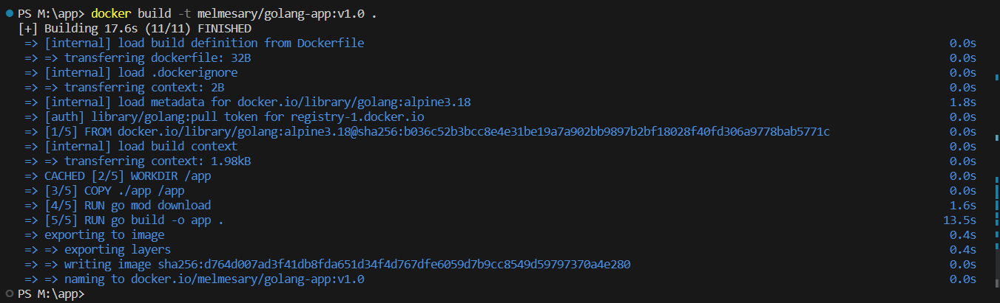
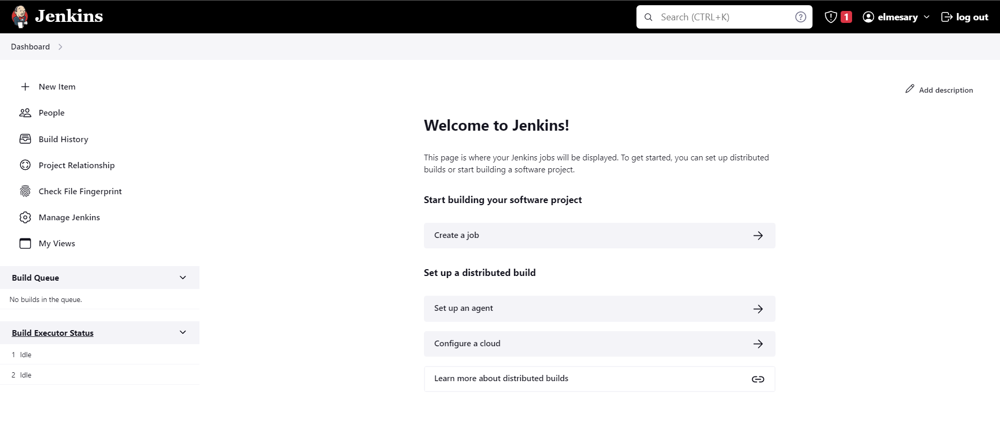
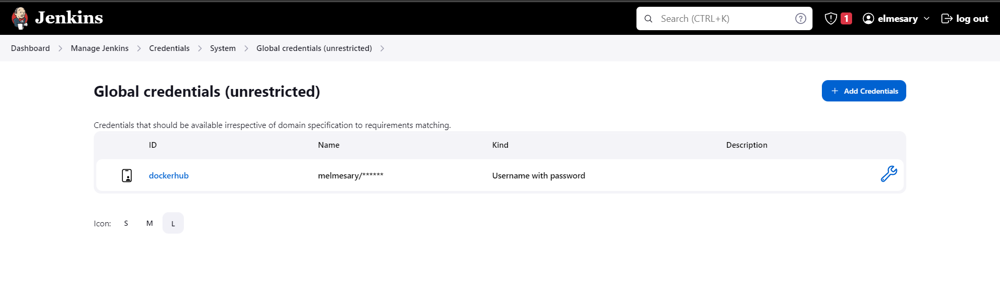
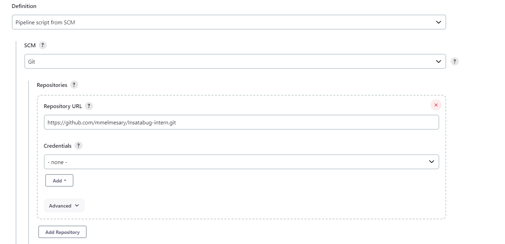
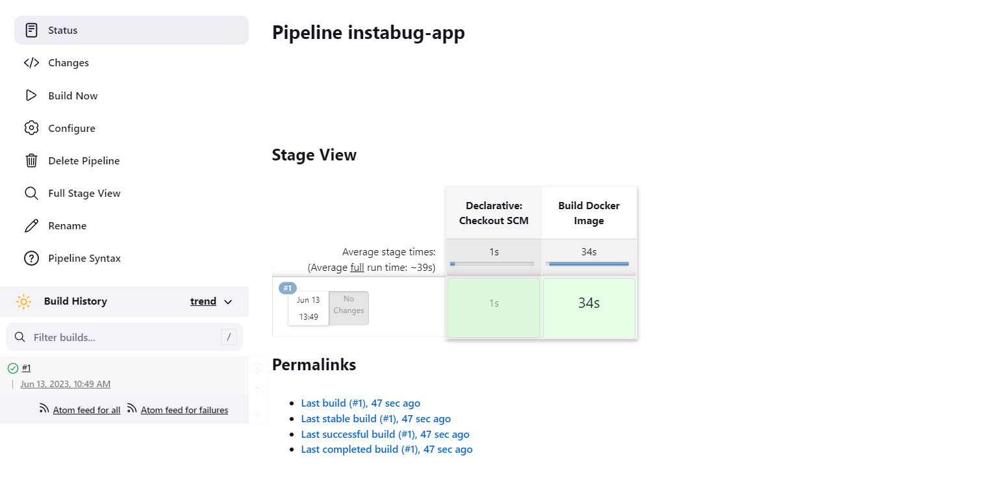
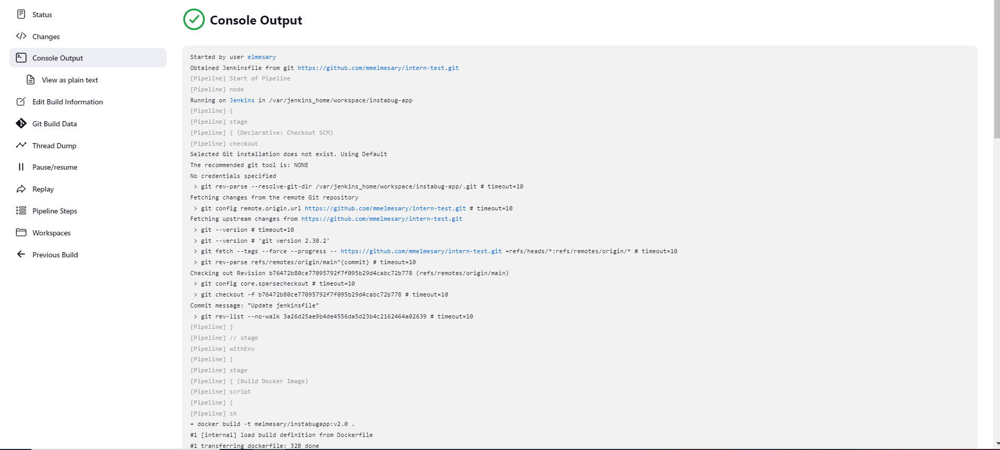
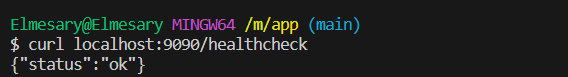

# Instabug intern task 

🚨 This DevOps project showcases how to use Dockerfile, Jenkinsfile, docker-compose, k8s, Helm charts, and ArgoCD 

## Step 1 : Dockerized Golang Application 

The `Dockerfile` containes the instrutions how to build and run a Go application using Docker, and it exposes the application on port `9090`.

To build the Docker image for this application, run the following command:

```bash
docker build -t melmesary/golang-app:v1.0 .
```
> You should see an output like that when run the above command

>  

______ 

 ## Step 2 : Pipeline Job

**To use the pipeline job, you need to have Jenkins installed and install docker-client plugin to run to run Docker commands inside Jenkins. Also You'll need to set up your DockerHub credentials in Jenkins**

**First** The `jenkins_with_docker` file containes all the instructions to use docker-client with jenkins, so try to build an image from that file and then run a container

To build the Jenkins image, run the following command:

```bash
docker build -t melmesary/jenkins:v1.0 -f jenkins_with_docker .
```

To run the Jenkins container, run the following command:

```bash
docker run --name jenkins -p 8080:8080 -v /var/run/docker.sock:/var/run/docker.sock melmesary/jenkins:v1.0
```
Run the following command to check that the container is up and running 

```bash
docker ps 
```
Open the Jenkins UI

 

> **✨ Contents**, Your Jenkins is now ready to create a job and run the pipline :tada:

 **Second** the `Jenkinsfile` file defines a pipeline job for building the application using the Dockerfile and reporting any errors that occur during the build process.

The pipeline job performs the following steps:

1. Clone the repository and checkout the latest code from the main branch.

1. Build the Docker image using the Dockerfile in the root directory.

1. Check for errors during the build process and report them.

1. Tag the Docker image and push it to DockerHub.

>  


**Now** Create a new job and run your pipeline 

>  

after running your pipeline you should see that your pipeline finished successfuly

> 
 
> 

___
# Step 3: Docker Compose

**The `docker-compose.yml` file defines a multi-container application that includes a MYSQL database service and our go application service.**

 To run the application using Docker Compose, run the following command:

 ```bash
 docker-compose up 
 ```

 To stop the application, run the following command:

```bash
 docker-compose down 
```
To perform a *health check*, run the following command:

```bash
curl localhost:9090/healthcheck
```
it returns an `OK` message

> 
